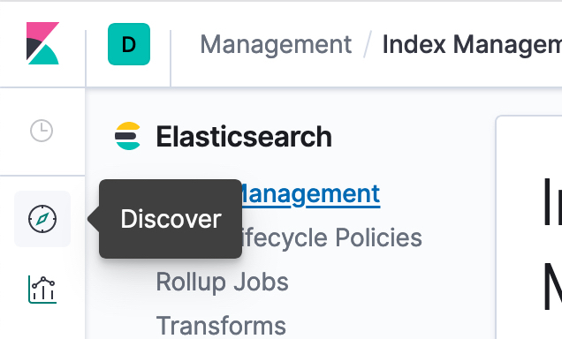

## Configuring Tyk Bank to pump Analytics to the ELK Stack

This repository contains an ELK container with ElasticSearch, Logstash, and Kibana.  These instructions will walk you through standing up the ELK container, configuring the Tyk Pump to push analytics from Tyk Bank into ElasticSearch, and visualizing this data in Kibana.


## Prerequisites

You should have Docker installed on your local machine.

## Running the ELK Container

1. In the root of the 'tyk-bank' directory run the following command:

`$ docker-compose -f docker-compose-elk.yaml up -d`

2. Verify that the ELK service containers are running by issuing the following command:

` $ docker-compose -f docker-compose-elk.yaml ps`

## Configure Tyk Pump for ElasticSearch

1.  Open the `tyk-bank/confs/pump.conf` file

2. Paste the snippet below into the 'pumps' section
```json
"pumps": {
    "elasticsearch": {
      "type": "elasticsearch",
      "meta": {
        "index_name": "tyk_analytics",
        "elasticsearch_url": "http://elasticsearch:9200",
        "enable_sniffing": true,
        "document_type": "tyk_analytics",
        "rolling_index": false,
        "extended_stats": true,
        "version": "6",
        "decode_base64": true,
        "bulk_config":{
          "workers": 2,
          "flush_interval": 60
        }
      }
}
```

3.  The Tyk Pump needs to be restarted to load the ElasticSearch configuration.  Run the following from the command line:

`$ docker-compose restart tyk-pump`

## Make API Calls To Generate Analytics
To generate analytics data we need to make at least a single call to any of the API's protected by Tyk. We can be do this by simply logging into Tyk Bank and making some transactions.


## Confirm Analytics Data made it to ElasticSearch

1. Open Kibana by navigating to `http://localhost:5601` on your local machine.

2. Once opened navigate to the gear icon at the bottom of the toolbar to open the Management menu
 


3. Select the Index Management Menu


4. Confirm that there is an entry for `tyk_analytics` in the Index Management Table


## Visualize ElasticSearch Data in Kibana

1. Navigate to the Discover Menu. 



2. Type `tyk` in to the Index pattern text box.  This should match on the tyk_analytics index.  


3. Now the ` > Next step ` button should be enabled, click it.

4. Select `@timestamp` from the Time Filter field name drop down list and click the 'Create index pattern' button.


5. Navigate back to the Discover Menu.  You should now be visualizing the request/response analytics from Tyk!
 
 
 

## TODO:
- Project only uses ElasticSearch and Kibana, would be nice to add Logstash to incorporate all of the ELK Stack.
