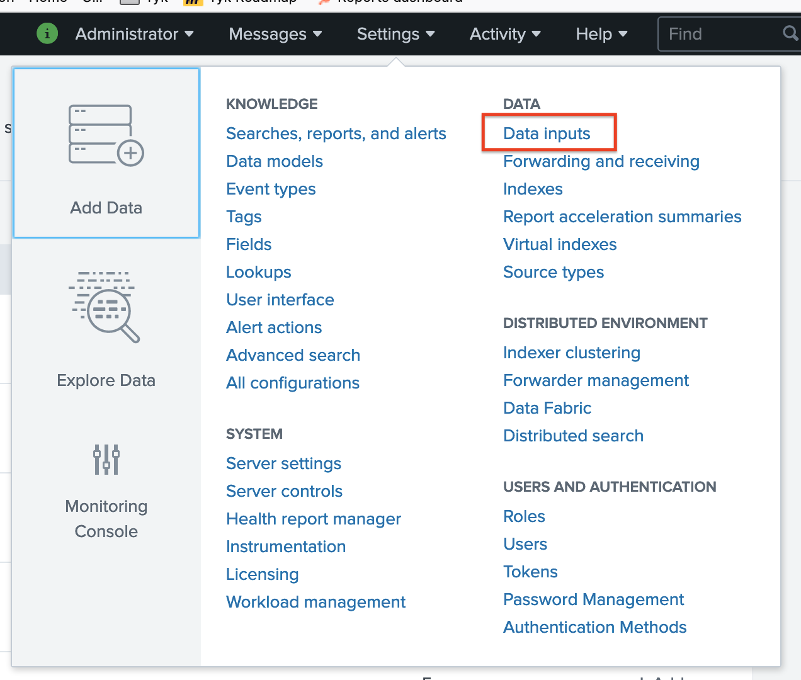

## Splunk Example With Tyk Analytics

## Running

In the root of `tyk-bank`, run

`$ docker-compose -f splunk/docker-compose.yaml up -d`

## Setting up

### 1. Setup a collector in Splunk

A) Visit http://localhost:8000 and log into the Splunk Dashboard using the username `admin` and the password you set in the docker-compose file.

B) Create a new Data input

### 2. Add the Splunk bit to pump.conf

asdsad

### 3. ????

sadsadas

### 4. PROFIT!
