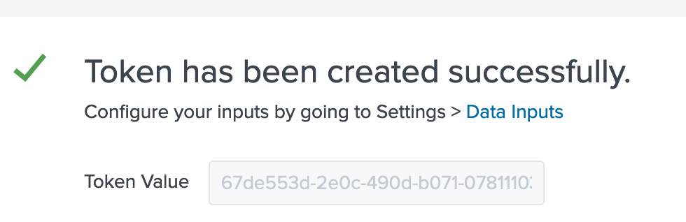
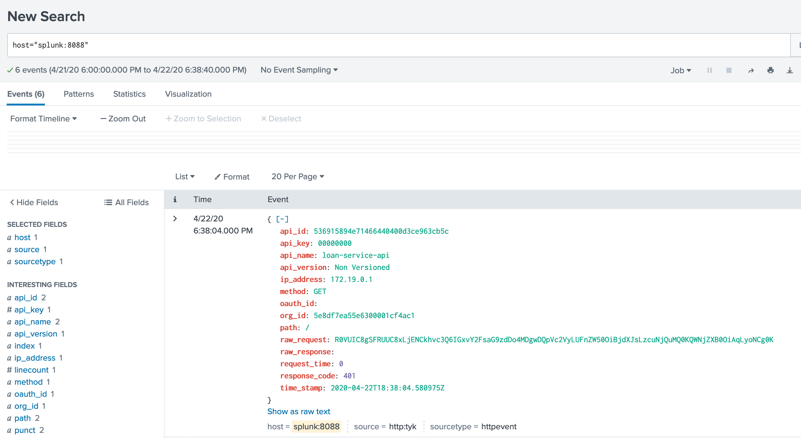

## Splunk Example With Tyk Analytics

This example walks you through how to setup Splunk and Tyk Pump with request/response analytics.

The only prerequisite is Docker.

## Running

In the root of `tyk-bank`, run

`$ docker-compose -f docker-compose-splunk.yaml up -d`

## Setting up

### 1. Setup a collector in Splunk

A) Visit http://localhost:8000 and log into the Splunk Dashboard using the username `admin` and the password you set in the docker-compose file.

B) Create a new Data input


C) Select `HTTP Event Collector -> Add New`  


D) Set the name to "tyk" and then leave everything else as default

Grab your token at the end page:


### 2. Add the Splunk bit to pump.conf

Edit `confs/pump.conf` and add this bit to the "Pumps" section, like so, adding the token from step #1:

```json
"pumps": {
    ...
    "splunk": {
        "type": "splunk",
        "meta": {
            "collector_token": "<token>",
            "collector_url": "https://splunk:8088/services/collector/event",
            "ssl_insecure_skip_verify": true
        }
    }
}
```

### 3. Restart Tyk Pump to include Splunk config

Run:

`$ docker-compose restart tyk-pump`

### 4. PROFIT!

Let's make a few API calls against Tyk, and see if they flow into Splunk

```bash
$ curl localhost:8080/loan-service-api/

{
    "error": "Key not authorised"
}%
```

Success:

